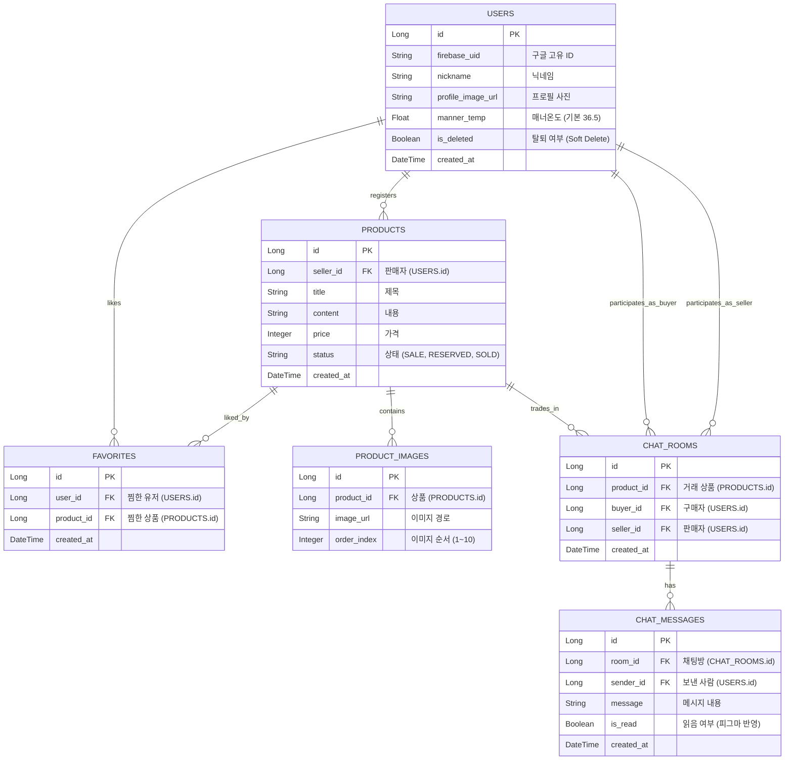

# Carrot V2 데이터베이스 관계도 (ERD)

기획된 핵심 기능(회원, 상품, 채팅, 찜)을 구현하기 위한 6개의 핵심 테이블 구조입니다.

## 핵심 설계 로직
1. **소프트 딜리트:** `USERS.is_deleted` 플래그를 사용하여 회원 탈퇴 시 데이터를 보존하면서 접근만 차단.
2. **채팅 읽음 처리:** `CHAT_MESSAGES.is_read`를 통해 상대방 접속 시 일괄 업데이트.
3. **다중 이미지:** `PRODUCTS` 테이블과 분리하여 `PRODUCT_IMAGES` 테이블에서 1:N 관계로 최대 10장 관리.
